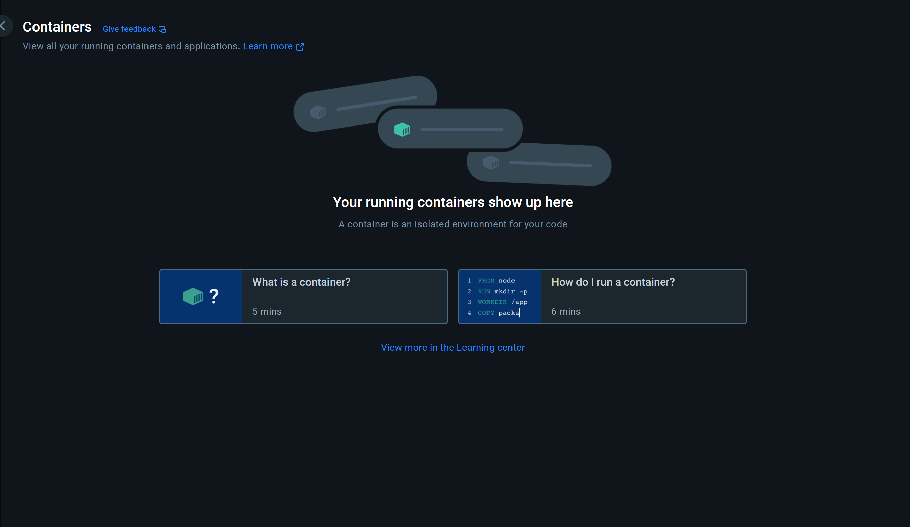
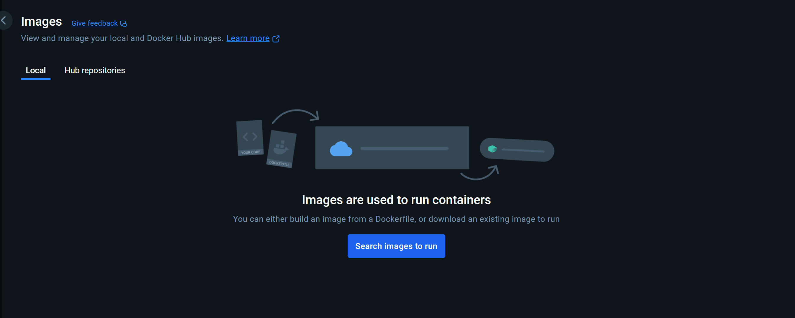
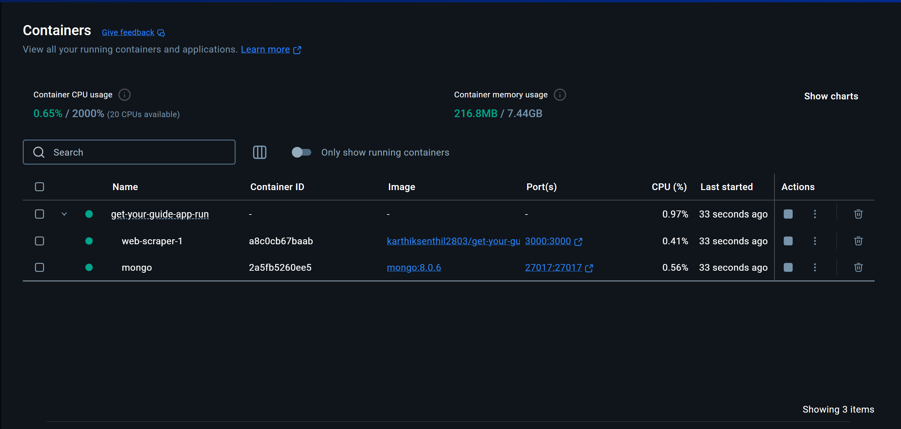

# 🕸️ GetYourGuide Web Scraper

This is a containerized application that scrapes tour data and stores it in a MongoDB database. It runs a web scraper service built into a Docker image and uses MongoDB to persist the scraped data.

## 🧰 Prerequisites

Before running the application, make sure you have:

- [Docker Desktop]() installed
## 🚀 Getting Started

### 1. Clone the Repository

```bash
git clone https://github.com/karthiksenthil2803/get-your-guide-app-run.git
cd get-your-guide-app-run
```

### 2. Start the Services

Use Docker Compose to start the application using the command line for the first time. The subsequent runs can be done from Docker Desktop.

First ensure Docker Desktop is up and running, then

```bash
docker-compose up
```

This will start:
- `web-scraper` on port `3000`
- `mongo` database on port `27017`

### 3. Access the Application

- Web scraper API will be available at: [http://localhost:3000](http://localhost:3000)
- MongoDB will be running at: `mongodb://localhost:27017/get-your-guide`

## 🛠️ Environment Variables

These are configured inside the `docker-compose.yml` file:

| Variable   | Description                            |
|------------|----------------------------------------|
| MONGO_URI  | MongoDB connection string              |
| PORT       | Port the web scraper will listen on    |

You do not need to change these variables from the compose file.

### 4. Docker Desktop Instructions.
- Initial State of Docker Desktop before running the above docker-compose command.



- After the ```docker-compose up``` is run for the first time, automatically a container will be created in Docker Desktop. You can use the created container to run the app henceforth.

Here, you can see that there is a service named web-scraper, click on it's port section and it should lead you to the application Swagger endpoint.

## Contact

Karthik Senthil (karthiksenthil2803@gmail.com)
